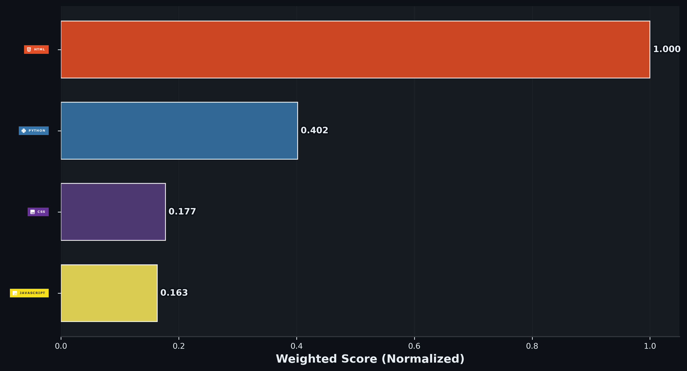

# ⚡👑 PRAVEEN KUMAR 👑⚡

### ✨ COMPUTER SCIENCE STUDENT ✨

  

---

  
# ⚡ PROFILE

<pre>
╔══════════════════════════════════════════════════════╗
║                                                      ║
║              👑 DEVELOPER DATABASE 👑                ║
║                                                      ║
║   👤 USER       : PRAVEEN KUMAR                      ║
║   💻 ROLE       : FUTURE SOFTWARE ENGINEER           ║
║   🟢 STATUS     : ONLINE                             ║
║   🌐 FOCUS      : WEB DEVELOPMENT                    ║
║   🐍 LEARNING   : PYTHON PROGRAMMING                 ║
║   🎨 DESIGN     : UI/UX WITH FIGMA                   ║
║   🚀 MISSION    : LEARN • BUILD • IMPROVE            ║
║                                                      ║
╚══════════════════════════════════════════════════════╝
  </pre>

  
# ⚡💛 TECHNOLOGY ARSENAL 💛⚡
# ══════════════════════════════════════

### 🚀 MY DEVELOPMENT TOOLKIT 🚀

 

  

# 💻⚡ MOST USED LANGUAGES ⚡💻

### 🚀 MY CODING LANGUAGE ANALYTICS 🚀

 

